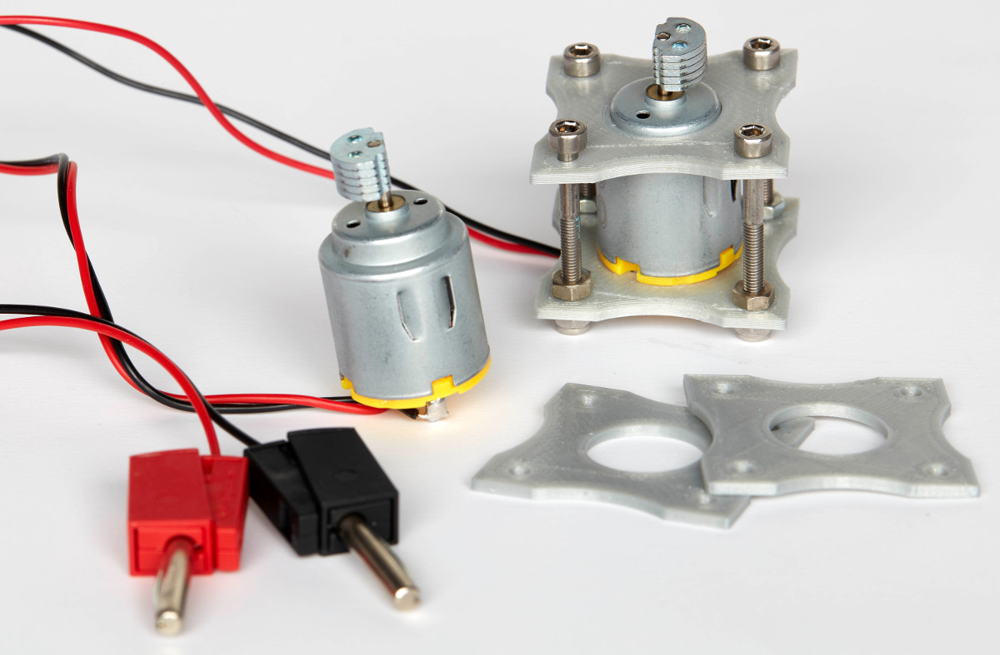
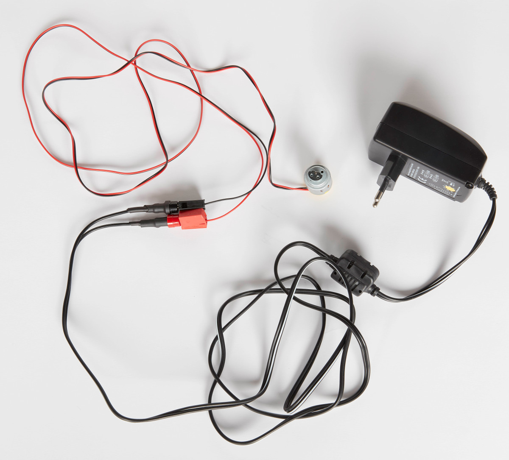

## Vibration motor - v1

The vibration motor is held in a housing comprised of two flat 3D printed pieces.

**Note that we present this version for consistency with the experiments presented in the manuscript. We advise using the motor v2 due to its longer lifetime.**

#### Parts

- [Vibration electric motor](http://www.sourcingmap.com/dc-156v-16500rpm-vibration-electric-micro-mini-motor-140-for-massager-p-811318.html) x1
- [3D printed motor housing](Motor_Housing_v1) x2
- 30 mm long M3 screws x4
- M3 nylon insert lock nuts x4
- M3 hex finish nuts x4
- Electric wires x2 (black and red)
- Banana plug cage clamp x2 (black and red)
- 5 V (0.5 A) power supply with adapter for banana plugs

#### Guidelines

> **Note**: These motors have a limited lifetime, we typically observed damages of the bearing axis or internal short-circuits after three to four days of continuous operation.

3D print twice the [motor housing](Motor_Housing_v1). Then, place the M3 screws through one of the plate's holes and screw the nuts on the other side. Place the motor head through the central hole and secure the motor by inserting the second plate through the screws. Lock the second plate in place between the hex finish nuts and the nylon insert lock nuts. 

> **Important**: The motor needs to be securely fastened in between the two plates otherwise it might rotate during operation time within the holder and break the cables.

To power the motor, you can for instance solder wires directly on the motor terminals. **Tip: apply adhesive at the soldering point to relieve vibration strain.** Use banana cage clamps at the other end of the wires and solder banana female plugs on a 5 V power supply (0.5 A):

Pictures credit: *EMBL/Marietta Schupp*