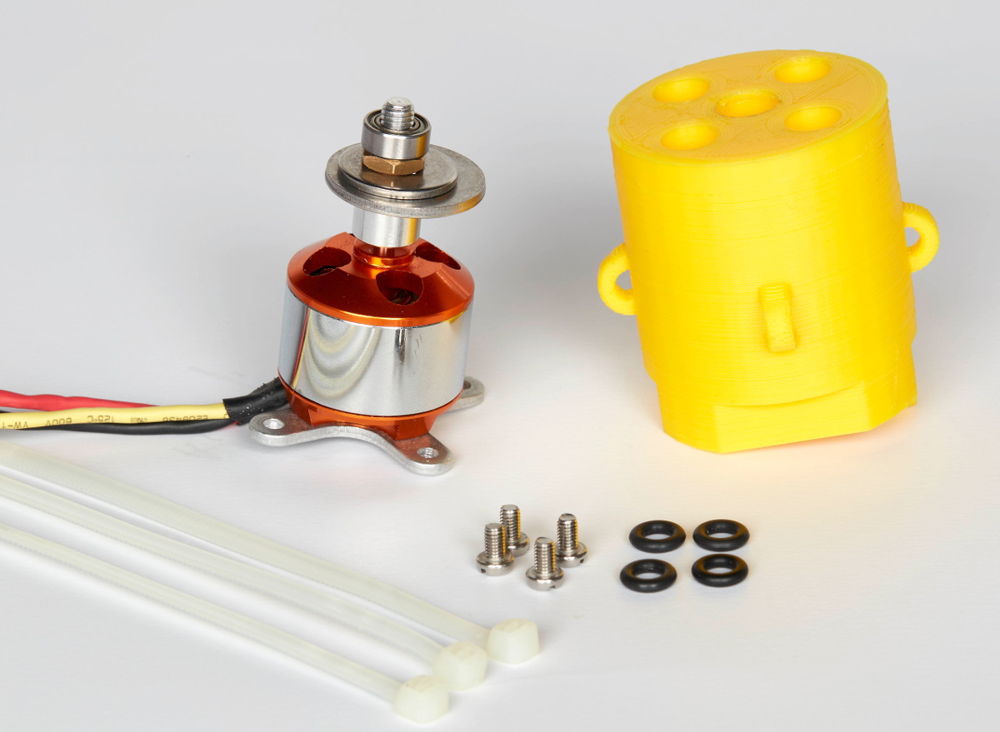
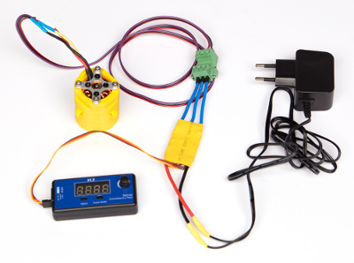

## Brushless motor - v2

The brushless motor is housed in a 3D printed holder. 

#### Parts

- [KEESIN RC 1000KV Brushless Motor A2212](https://www.amazon.de/gp/product/B07BS7DFW3) x1

- [3D printed motor housing](Motor_Housing_v2) x1

- [Servo controller for speed control](https://www.amazon.de/gp/product/B07K6D9ZDQ/ref=ox_sc_act_title_1?smid=A1SPOY0RBPE5BD&psc=1) x1

- 6 mm long M3 screws x4

- 2.6 mm thick M5 hex jam nut x1

- 8 mm (inner) - 24 mm (outer) diameters extra thick fender washer x1

- 6 mm (inner) - 18 mm (outer) diameters fender washer x1

- [MR105 Ball bearing (5x10x4 mm)](https://www.kugellager-express.de/miniature-deep-groove-ball-bearing-mr105-2rs-5x10x4-mm) x1
  or
  [MR115 Ball bearing (5x11x4 mm)]( https://www.kugellager-express.de/miniature-deep-groove-ball-bearing-mr115-2rs-5x11x4-mm ) x1
  (make sure to use the correct motor housing)

- 12 V (0.5 A) power supply

  Definition of mechanical elements according to [this page](https://www.albanycountyfasteners.com/Fastener-Varieties-s/1130.htm).

#### Guidelines

2. Fix the cross holder on the back of the motor using the screws shipped with the motor.

3. Place the [collet prop adapter](https://robu.in/product/aa212-motor-prop-adapater-collet-type/) on the [motor shaft](https://en.wikipedia.org/wiki/Shaft_(mechanical_engineering)) without the bullet tip adapter (see picture above). Add the large [fender washer](https://www.bokers.com/fender_washers.asp) then the smaller one onto the prop adapter thread. Finally screw in the M5 nut so that the fender washers are fixed non-concentrically (see how the washers are not centered on the picture) and that the prop adapter is securely clamped on the motor shaft (thanks to the [collet](https://en.wikipedia.org/wiki/Collet)). **It is important that the center of gravity of the fender washers is not on the shaft axis to produce strong agitation.**

4. Add the ball bearing to the prop adapter thread.

5. Insert the motor in the 3D housing so that the ball bearing fits in the central stepped hole.

6. Screw the motor on the housing with the M3 screws.

8. In order to power the brushless motor, you can for instance solder extensions on the wires of the motor and insert them in an adapter (here WR-TBL Serie 3405, Würth). Similarly, cut the cables on the controller and insert the bare ends in the complementary adapter (here WR-TBL Serie 3485, Würth). **Make sure to respect the correct cable connection.** Finally, solder the power and ground cables on the other side to the 12 V power supply (0.5 A). You can use the [servo controller](https://www.amazon.de/gp/product/B07K6D9ZDQ/ref=ox_sc_act_title_1?smid=A1SPOY0RBPE5BD&psc=1) to provide the speed signal. Note that in this case the servo controller gets its power from the motor controller, and the motor is powered directly from the power supply.

   

Pictures credit: *EMBL/Marietta Schupp*
