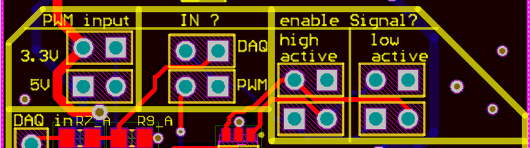

## Electronics (alternative)

#### **Important: the electronics described here was validated using a prototype only.**

The electronics introduced in this section is an alternative to the electronics used on our microscopes and in the manuscript. It should more easily reproducible as it does not involve modifying the laser diode drivers and uses only a single custom board. However, the laser diode drivers and the power supplies are substantially more expensive. 

- **Input** (per laser diode): a TTL signal (3.3 V or 5 V) for triggering and a PWM signal (3.3 V or 5 V) for laser power control.
- **Triggering with ms pulses**.
- **Capping of the current to the laser diodes to avoid damage**.

#### Parts

For the four diodes described in [this section](https://github.com/ries-lab/LaserEngine/tree/master/Electronics).

- [High current driver LD3000R](https://www.thorlabs.de/thorproduct.cfm?partnumber=LD3000R) x2

- Power supply for the LD3000R: Note that the LD300R requires positive as well as a negative voltage power supplies. Contact Thorlabs for guidelines on choosing an appropriate power source.

- [Low current driver LD1255R](https://www.thorlabs.de/thorproduct.cfm?partnumber=LD1255R) x2

- [Power supply for the LD1255R + cable](https://www.thorlabs.de/newgrouppage9.cfm?objectgroup_id=1366) x2

- [Custom laser diode signal conversion board](Custom_board) x1

- Power supply for the custom board (12 V) x1

- Controller (Arduino or Mojo FPGA) capable of delivering 3.3 V or 5 V TTLs and PWMs signals. 

#### Guidelines

The laser diodes used in this project require two different current range: 60-150 mA (405 nm and 488 nm LDs) and 100-1000 mA (638 nm LDs). Therefore they are controlled here by two different LD drivers:

|                    | 405 nm & 488 nm                                              | 638 nm                                                       |
| ------------------ | ------------------------------------------------------------ | ------------------------------------------------------------ |
| Laser diode driver | [LD1255R](https://www.thorlabs.de/thorproduct.cfm?partnumber=LD1255R) | [LD3000R](https://www.thorlabs.de/thorproduct.cfm?partnumber=LD3000R) |

Each LD driver can be set to an external control mode by placing a jumper on two pins (J2). Refer to their respective data sheet and set them to external control mode.

The [custom signal conversion board](Custom_board) takes two inputs (3.3 V or 5 V):

- TTL trigger for on/off switching and pulsing
- PWM for power control

The board features five channels (for five laser diodes) that can be adapted to the input type and voltage. Each channel has a header:

Using jumpers, choose for each channel:

- 3.3 V or 5 V input
- Analog or PWM input for power control
- High or Low active for the trigger

**Important: place only a single jumper in each section (the yellow rectangles on the picture)! Note that for the high or low active, there are two sections, therefore two jumpers are necessary (top and bottom).**

The signal conversion board produces an analog signal that can be fed directly onto the external control pin of the LD drivers. **In addition, it features a potentiometer that allows decreasing the maximum voltage fed to the LD driver (< 5 V) in order to cap the current at the laser diode and prevent damages.**

Finally, make sure to correctly wire the anode and the cathode of each diode to the proper pin on the LD drivers.

> **Note**: The last segment of the circuit (see [circuit](circuit)) holds two resistors R5 and R6 which are open and 0 Ω respectively. Therefore this part of the circuit is just a voltage follower. However, replacing R5 and R6 would allow for higher output voltage if ever necessary (e.g. 0-10V). 
>
> **Note**: We did not attempt to supply the positive and negative voltages for the LD3000R, LD1255R and the custom board using the same sources. It should be possible to reduce the number of power supply by grouping them.