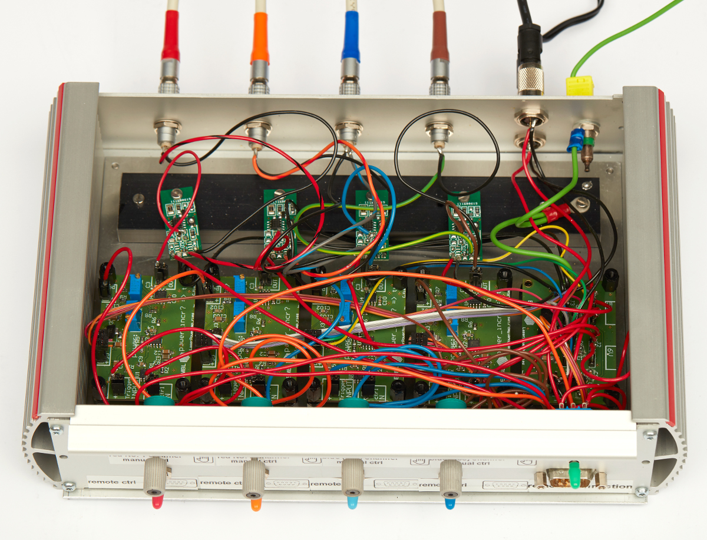
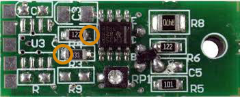

## Electronics (manuscript)

This section describes the electronics used in the paper. Here, the electronics is based on an inexpensive laser diode driver and was packaged in a control box.

The commercial **laser diode drivers** can be seen on the top row of the picture. They have been modified to bypass the board potentiometer with the output of the **signal conditioning board** (bottom row). There is one laser diode driver and one voltage conditioning board per laser diode. Finally, a **voltage distribution board** (bottom right) provides the correct voltage to each of the other elements.

The electronics has two inputs per laser diode:

- 3.3 V TTL trigger signal to switch on or off the diodes (< MHz)
- 3.3 V PWM (>= 1kHz) signal

**This section does not describe the boxing out of the electronics. You can find a description of the wiring involved in the [wiring](Wiring) submodule.** In particular, a feature of our electronics box is a main switch to turn on/off the laser diode and switches to allow for individual manual or remote control of the laser diodes.

#### Parts

For the four diodes described in [this section](https://github.com/ries-lab/LaserEngine/tree/master/Electronics), we need:

- [Laser diode driver](http://www.roithner-laser.com/ld_electronics.html) (eu-38-ttl, Roithner) x4

- Heat sink for the laser diode drivers (see picture above)

- [Signal conditioning board A](Custom_signal_conditioning) x2

- [Signal conditioning board B](Custom_signal_conditioning) x2

- [Voltage distribution board](Custom_voltage_distribution) x1

- [Power supply #1](https://www.reichelt.com/de/en/eco-friendly-plug-in-power-supply-max-1000-ma-usb-mw-3k10gs-p87339.html?&trstct=pos_0) (set to 6 V, 1 A)

- [Power supply #2](https://www.reichelt.com/de/de/steckernetzteil-12-w-5-v-2-4-a-stabilisiert-gs15e-1p1j-p161604.html?&trstct=pos_0) (5 V, 2.5 A)

- Controller (Arduino Due or [Mojo FPGA](https://github.com/jdeschamps/MicroMojo)) capable of delivering 3.3 V TTLs and PWMs signals 

  

#### Guidelines

 The guidelines describe few steps we took to build the electronics. For each laser diode, theses steps were followed independently. We advise repeating these steps in case of laser diode to laser diode variability. If you order the custom boards with the components already soldered, they you might want to verify the first steps to insure you have the correct current range output. The grounds from all boards and power supplies are connected.

> **Important**: **The laser diodes need to have proper heat dissipation otherwise they will not reach their maximum output power and will shut off, or even be irremediably damaged.** 

1. In all further steps, the voltage supply originates from the [voltage distribution board](Custom_voltage_distribution). Check the corresponding submodule for the guidelines relative to the voltage supply wiring.

   > Note: In our case, the laser diode drivers for the 405 nm and 488 nm required 5 V, while the drivers for the 638 nm laser diodes required 6 V.

2. **Connect the commercial laser diode driver to the laser diode without powering it**. Respect the anode / cathode pins. **Decrease the potentiometer to the minimum (measure the output current)**.

3. Slowly increase the laser diode output power using the potentiometer and measure the voltage between the two resistors (see picture). Measure the voltage at the maximum power output (Vmax): 

   |  |
   | :----------------------------------: |
   | Copyright Roithner LaserTechnik GmbH |

   For instance, we obtained:

| 405 nm  | 488 nm  | 638 nm (1) | 638 nm (2) |
| ------- | ------- | ---------- | ---------- |
| 40 mV | 40 mV | 330 mV    | 330 mV    |

   Measure in addition the **maximum current** going to the laser diode.

4. Then, **[calculate](http://www.ohmslawcalculator.com/voltage-divider-calculator)** the resistors needed in the voltage divider part of the signal conversion board. As we wanted to scale the voltage from 0 - 3.3 V to 0 - Vmax. In our case, this yields two different **signal conditioning boards (A and B)** with different voltage division factors (see **[circuit](Custom_signal_conditioning/Circuit)** for the positions of the resistors R1, R2 and R3):

   |                         | A: 405 / 488 nm | B: 638 nm |
   | ----------------------- | --------------- | --------- |
   | Voltage division factor | 79              | 10        |
   | Z1 (R1 + R2)            | 68 + 10 kΩ      | 0 + 9 kΩ  |
   | Z2 (R3)                 | 1 kΩ            | 1 kΩ      |

   > Note: The voltage divider circuit is followed by an amplification and offset stages on the circuit. The choice of the voltage division dictates the range of current that can be supplied to the laser diode driver. Choosing a lower voltage after division would allow for the possibility to decrease in the future the maximum voltage supplied without exchanging the resistors.

5. **Once the resistors soldered on the signal conditioning board**, the output voltage (Out signal) range needs to be tuned using the two **potentiometers (#1 and #2, respectively R10 and R12 on the [circuit](Custom_signal_conditioning/Circuit))** present on the board. **Connect the PWM (3.3 V, we used a period of 2 ms) source to the signal conditioning board**.

6. In an iterative manner, turn potentiometer #1 (offset) so the minimum of the PWM signal corresponds to a slightly negative voltage (few mV). Then tune potentiometer #2 (gain) so that the maximum of the PWM corresponds to expected maximum output voltage. Repeat until the minimum is few mV negative and the maximum the expected value measured in step 2.

   > Note that if you did not reach the correct range, the voltage divider factor will have to be modified to increase or decrease it (by choosing different resistors).

7. The next step requires modifying the commercial laser diode driver and connecting it to the signal conditioning board. Unsolder the resistors on the laser diode driver at the points where the voltage was measured previously. **Pull the unsoldered pins away from the board and solder them together with the positive output from the signal conditioning board**.
   

   > **Note from Roithner Lasertechnik GmbH**: Any modification to the EU-38-TTL is carried out at ones own risk and responsibility. Roithner Lasertechnik GmbH has not verified and can not be held liable for any operating failure or damage resulting from the modification to the driver.

8. Before connecting back the laser diode, verify that the current output of the laser diode driver is still close to the measured current in step 2.
9. If the laser diode is still emitting at the minimum PWM value, decrease slightly potentiometer #1.
10. Repeat for the other laser diodes. Then wire the TTL inputs directly on the laser diode drivers.
    

#### Possible improvement

- Remove the 3.3 voltage generation in the signal conditioning boards and instead make it available through the voltage distribution board.
- Redesigned the voltage distribution board to take only the 5 V power supply and generate the 6 V voltage by itself.

Close-up picture of the modified laser diode driver credit: *EMBL/Marietta Schupp*

