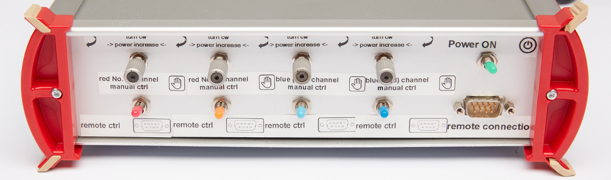
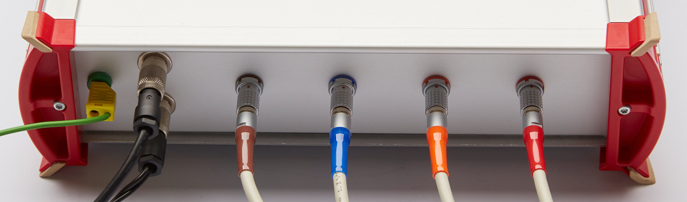
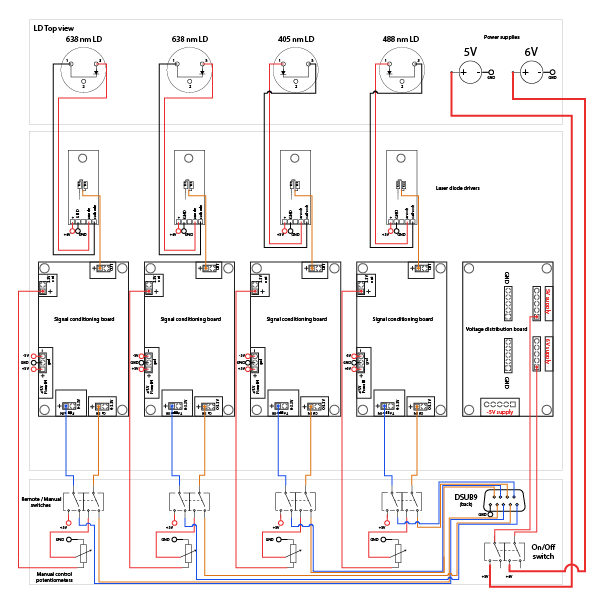

## Wiring

We packaged our electronics in a compact aluminium box (as seen in the picture [in the previous section](https://github.com/ries-lab/LaserEngine/tree/master/Electronics/Electronics_manuscript)).

Our electronics box displays a main switch allowing to interrupt the connection between the power supplies and the voltage distribution board. In addition, for each diode we added a switch between manual and remote control, as well as a potentiometer to control the laser diode power in manual mode. The laser diodes are then connected to the electronics box using a custom cable. Here are the front and back of the electronics box:

The wiring within [the electronics box](wiring.pdf) is described in the pdf file:

#### Parts

In addition to the laser diodes, laser diode drivers, voltage conditioning boards, the voltage distribution board and the power supplies (which are described in the other submodules). 

- Aluminium enclosure (~22 x 15 cm)
- Double pole double throw switch x5
- Potentiometer x4
- DSUB9 plug: connected to 4 x TTL and 4 x PWM signals

> **Important**: You need to ground the aluminium box with the circuit and its surroundings (see green wire on the picture).

 
