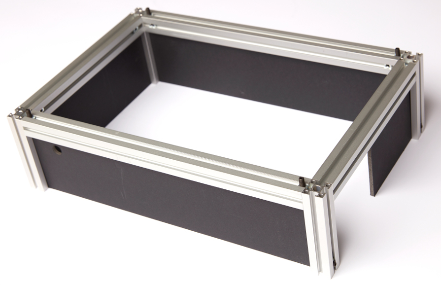

## Enclosure

The enclosure serves two purposes: protect the users from laser light and prevent dust from depositing on the optics. 

#### Parts

- [Aluminium profiles (25.01.####, mk)](Posts)

- [Foamboard panels (LKG55070, Boesner)](Foamboard_panels)

- [Tension fasteners](https://shop.mk-group.com/verbindungselemente/spannverbindungen/296/spannverbinder-serie-25) x8

- Tension plug (see mk catalog, 25.50.3321, mk) x4

- 3 mm M6 square nuts and 16 mm M6 maggot screws (x4)

  > **Note**: The mk 25 profiles can be bought directly from the company. An alternative to the mk 25 system is sold by [Thorlabs](https://www.thorlabs.de/newgrouppage9.cfm?objectgroup_id=194).

The components are also referenced in the [part list](Parts).

#### Guidelines

#### :warning: The foam board is sensitive to laser light and can catch fire, place beam stop to prevent string laser light from hitting the panels. :warning:

The enclosure consists of a mk 25 aluminium profile system and foamboard panels (LKG55070, Boesner) :

The aluminium profiles drawing can be found in the following [folder](Posts). In order to build the enclosure, 8 MK25 aluminium profiles are necessary: 4x 120 mm long (vertical pillars), 2x 250 mm long (short side) and 2x 400 mm long (long side). 

> **Note**: All horizontal pillars have two holes on the same face to accommodate the tension fasteners (B51.03.009, mk). The fastener principle is explained in the following [catalogue](https://www.mk-group.com/fileadmin/media/catalog/en/mk_Profile_Technology_4.0.pdf), page 104. The vertical pillars have a single hole allowing locking a tension plug (25.50.3321, mk) in a similar manner.

The horizontal profiles are fixed to the vertical pillars using the tension fasteners (B51.03.009, mk). Next, we used four [foamboard panels](Foamboard_panels) inserted in the rim of the vertical pillars as side panels for the enclosure. Note that we did not draw the hole for the 561 nm laser, as this might depends on the laser itself and its mounting principle.

Four additional M6 square nuts (3 mm thick), each wtih a M6 maggot screw (16 mm long), were inserted in the top rim of the horizontal long-side pillars. The M6 screws therefore stick out of the horizontal pillar rims (see picture) and correspond to the four holes in the foamboard lid. Place the nuts correctly, then tighten the maggot screws to lock the nut in position.

Finally, we placed four mk tension plug (25.50.3321, see mk catalogue) on the laser engine breadboard corner M6 thread. The heads of the tension plugs fits in the central column of the vertical pillars and can be secured with a square nut and screw as before (see the base of the vertical pillars on the right side of the picture).

As in the picture above, the side panels have cut-out corresponding to specific elements of the laser engine: a circular hole to allow the optical fiber to enter the laser engine, a cut-out of the diode mount size and a circular hole for the 561 nm laser (optional, not drawn/represented here).  

Pictures credit: *EMBL/Marietta Schupp*