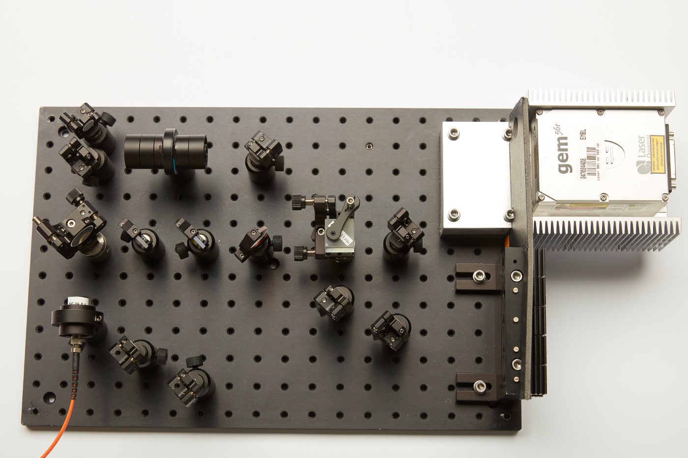
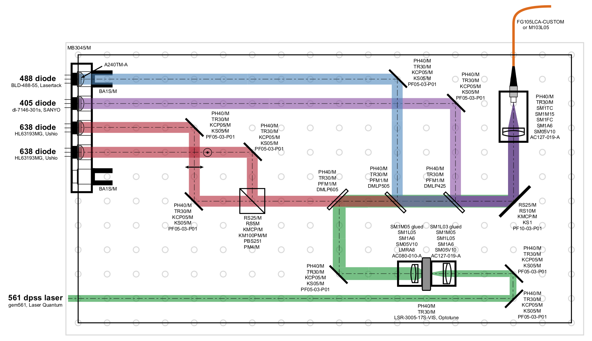

## Laser engine optical path

The laser engine is composed of four submodules: the diode holder, the main optical path, the enclosure and the LSR system. The main optical path is described here, check the submodules for the corresponding part lists and guidelines.

#### Parts

- [405 nm laser diode (dl-7146-301s, Sanyo)](http://www.roithner-laser.com/ld_standard.html) x1

- [488 nm laser diode (BLD-488-55, Lasertack)](https://www.lasertack.com/en/55mw-488nm-laser-diode) x1

- [638 nm laser diodes (HL63193MG, Ushio)](https://www.lasershop.de/en/ushio-hl63193mg-red-laser-diode-700mw-5-6mm.html) x2

- [Diodes mount](Diodes_Mount)

- [Thorlabs part list](Parts/Thorlabs_parts_list)

- [Enclosure](Enclosure)

- [**(Optional)** 561 nm dpss laser](https://www.laserquantum.com/products/detail.cfm?id=65)

- [**(Optional)** LSR system](LSR)

  

#### Guidelines

The laser engine optical path is build on a breadboard, with each optical element centered on a hole to facilitate alignment:

The main optical path is composed of Thorlabs parts. Refer to [the following pdf](Optical_path_with_Thorlabs_parts.pdf) for the exact composition and position of each element (here in lower resolution):

Note that the LSR system is only needed if you need further speckle reduction with a dpss laser. The alignment procedure for the LSR system can be found [here](LSR). The LSR system is composed of all elements of the beam path that are exclusively on the 561 nm laser path.

> **Important**: The laser diode and dpss laser can be quite bright and will be collimated during alignment, **wear appropriate laser light protection**.

1. The first step is to mount the diodes in the holder and collimate them (see [diodes mount](Diodes_Mount)).
2. Place and fix the mount on the breadboard (use the picture above as reference for the positioning) so that the back is aligned with the edge. The collimated beams from each diode should go along the breadboard holes.
3. The easiest way to align the coupling system (multimode fiber and lens) is to couple an alignment laser from the optical fiber exit (with respect to the laser engine) and collimate the output. Place the fiber adapter plate at the extremity of the SM1M15 lens tube. The lens tube can then be held by a SM1 clamp (SM1TC) mounted on the post. Then mount the 19 mm lens in the 1/2" adjustable lens tube (SM05V10) and place the lens tube on the SM05-SM1 adapter.  At the other extremity of the SM1M15, screw the adapter with the lens residing inside the lens tube (SM1M15). You can then move the lens inward by screwing further the SM05V10 on the adapter. Once the laser light collimated, fix the SM05V10 with the locking ring.
4. Use the collimated laser coming from the optical fiber to fix the coupling system at the right height (**70 mm**) and angle (laser along the holes of the breadboard).
5. Place the reflective elements (mirrors, dichroics, beam splitter) at the positions indicated [on the optical path plan](Optical_path_with_Thorlabs_parts.pdf). Use the collimated laser to set the heights and angle (laser going along the holes).
6. Remove the alignment laser and place a power meter at the fiber exit in order to report the laser power coming out of the optical fiber. Each laser beam has two mirrors (or one mirror and one dichroic mirror) allowing to walk the beam. Start by aligning the shortest wavelength (here the 405 nm diode): first walk the beam until some laser light exits the fiber, then maximize the power coming out.
7. Repeat for the 488 nm diode. 
8. If present, align the 561 nm laser. If applicable, refer to the [laser speckle reducer](LSR) module in order to mount the LSR correctly. Coupling of the laser in the optical fiber is better achieved with the LSR turned on (as the coupling efficiency might be different with or without the LSR running).
9. The two red laser diodes are superimposed using perpendicular polarizations and a polarization beam splitter. In order to align the polarizations, place the polarization beam splitter in the right orientation (refer to the [Thorlabs page](https://www.thorlabs.de/newgrouppage9.cfm?objectgroup_id=739) for the cube orientation). Then slightly unscrew the heat sink on the first red diode. If the diode beam is the transmitted one, then rotate the diode until its profile is horizontal (you need to be above the lasing threshold). Maximize the transmitted power through the beam splitter before fixing again the diode on the mount.
10. Next, repeat the procedure with the second laser diode, with this time a perpendicular orientation of the beam profile. (If the laser beam is the reflected beam, then the profile should be oriented vertically).
11. Finally, maximize the coupling of the red diodes in the optical fiber by beam walking them. Coupling can further be improved by also rotating the square optical fiber so that the long axis of the fiber profile is aligned with the long axis of the diode profiles. 
12. Place the enclosure on top of the breadboard to protect the user and the optics. 
    **:warning: Warning: make sure to place beam stops to prevent strong laser light from hitting the foam board, as it can catch fire. :warning:**
13. The illumination on the microscope is described in the paper and might depends on the microscope itself.

We obtained the following coupling efficiencies (these might vary):

| with square optical fiber (M103L05) | Coupling efficiency |
| ----------------------------------- | :-----------------: |
| 405 nm                              |         47%         |
| 488 nm                              |         80%         |
| 638-1 nm                            |         80%         |
| 638-2 nm                            |         80%         |
| 561 nm (LSR)                        |         60%         |
| 561 nm (no LSR)                     |         81%         |

> Note that the fiber launch might also have an impact on the illumination profile and that playing with the coupling in of the laser beam can lead to a better profile (more top-hat) albeit with a lower coupling efficiency. 

Pictures credit: *EMBL/Marietta Schupp*
